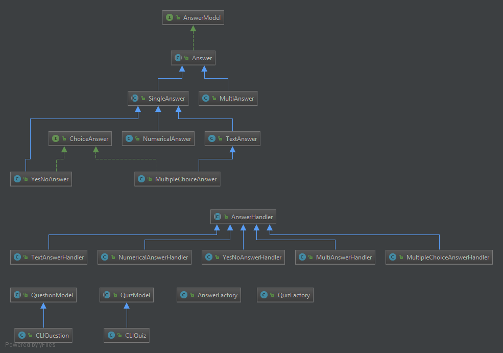
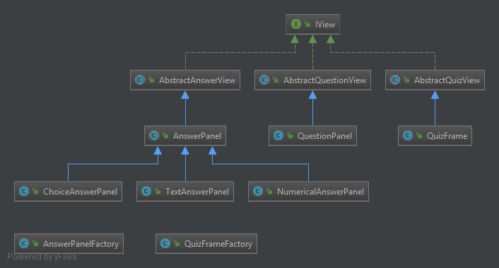
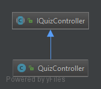
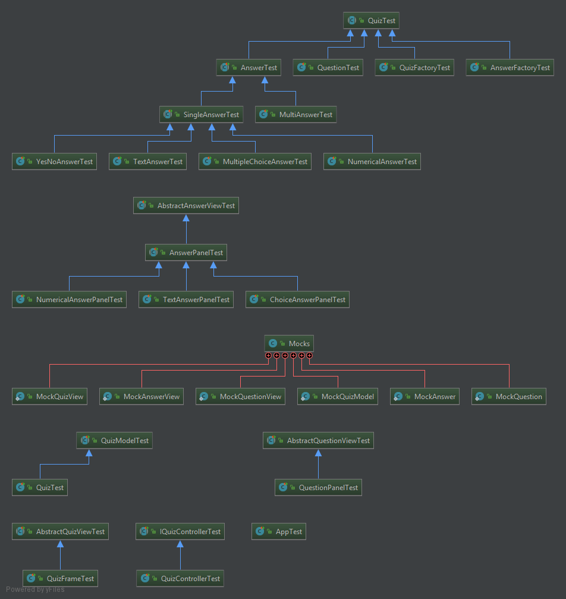
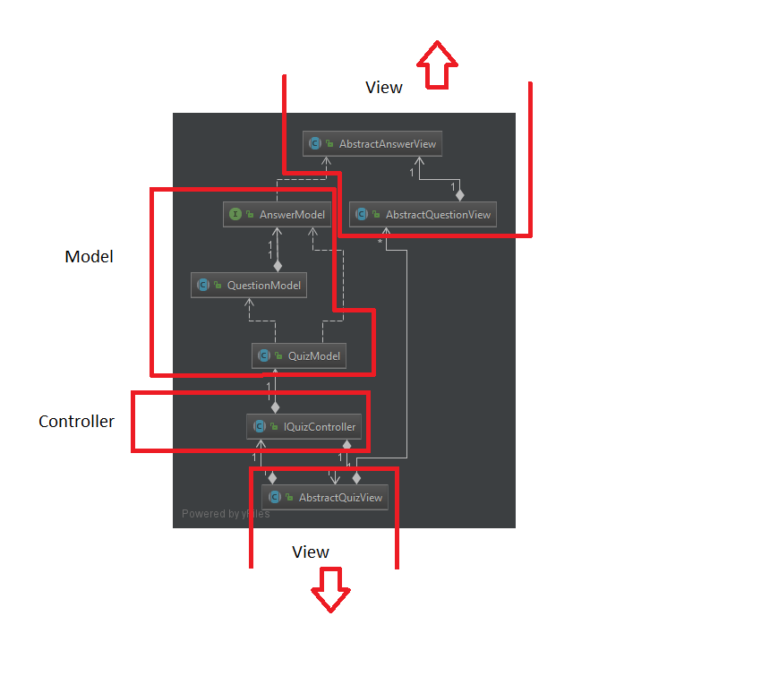

Bienvenue sur notre TP Quiz
===================

----------

Mini projet réalisé dans le cadre de la Conception Orienté Objet par Christopher Caroni et Leprêtre Guillaume. Ce projet sera évalué par notre professeur de TD Quentin Baert. Dans ce tp, vous pouvez répondre à un questionnaire en mode texte ou graphique

# Composition du TP :

- Le code source dans `src/main`
- Les tests unitaire dans `src/test`
- Les différents UML dans `/diagrams`. Attention: tous les diagrammes ne sont pas présentés dans ce readme car elles n'apportent pas forcément
plus d'aide à la compréhension de l'architecture du projet.
- Le `README.md` de ce tp

# Composition du TP :

- Le code source dans `src/main`
- Les fichiers texte quiz dans `/resources`
- Les tests unitaire dans `src/test`
- Les différents UML dans `/diagrams`. Attention: tous les diagrammes ne sont pas présentés dans ce readme,
  et certains diagrammes peuvent "cacher" des classes car elles ne présentent qu'une petite de ces vue.
- Le `README.md` de ce tp

# Mise en place du TP :

- Télécharger l'archive à l'aide de la commande `git clone`
-  Compiler avec la commande `mvn package` ou `mvn clean install`
- Vous pouvez générer la javadoc avec la commande `mvn javadoc:javadoc`
- Pour lancer le programme, exécuter la commande  `java -jar COO-QUIZ-VERSION.jar <quiz_file> [-t | d]` dans le dossier `target` avec les arguments adéquat
- Pour voir les utilisations des arguments faites `java -jar COO-QUIZ-VERSION.jar -h`

# Diposition des classes :

L'architecture principale de ce projet se définit grâce à la structure MVC qui est présentée ci dessous:
## Les modèles

## Les vues

## Le controlleur

# Tests :

Lors de la réalisation de notre tp, nous avons continuer de déveloper en `TDD` (Test Driven Developement), en particulier pour les classes `Answer` où nous avons pu régler de nombreux problème lors du dévelopement de ce projet. 
Par le biais du fichier `.gitlab-ci.yml`, nous pouvons executer les tests de notre projet avec Maven, directement sur git.

Ainsi, vous pouvez voir ci-dessous que les tests exécutés sont correcte :

Master branch:

Vous pouvez voir ci-dessous l'UML des différents test: 

## MVC

Pour la réalisation graphique nous avons décider de créer une architecture `MVC` (Model View Controller). Le but est de séparer le projet en 3 parties :

- Le `modèle` qui est le corps des `données` où elles sont sont manipulés et stockées
- La `vue` représente le `modele graphique.` C'est ce que l'utilisateur va voir et où il va pouvoir intéragir avec notre quiz.
- Le `controlleur` va reçoit des évenements de la vue, récupère les données de l'utilisateur et les vérifies contre les données du modèle. Ensuite, il peut notifier la vue du résultat.

Ainsi, la vue est complètement indépendante du modèle et vice versa. Seul le controlleur dépend de ces deux, mais il s'agit de vérifier l'utilisation de classes abstraites ou d'interfaces
afin de limiter le plus possible les dépendances à une conception spécifique.

L'utilisation de cet architecture permet d'avoir une conception claire et efficace, un gain de temps en terme d'évolution et maintenance du projet ainsi qu'une plus grande souplesse entre les développeurs d'une équipe en terme de partage de tâches. 

Vous pouvez voir ci-dessous les classes présentes dans notre mvc ci-dessous :

Dans cet uml, on affiche aussi les dépendances entres les différentes classes. On voit que le modèle et bien indépendant des vues, sauf pour une petite dépendance entre
`AnswerModel` et `AbstractAnswerView`. Ceci est parce que l'on a besoin de créer une vue spécifique selon la type de réponse qu'on attend de l'utilisateur.  
Ceci viole en quelque sorte le principe OCP mais on a limitée les dépendances à un stricte minimum. On utilise le `double dispatch` pour savoir quelle classe de vue
il faut créer pour un modèle spécifique. Après, dans notre `AnswerPanelFactory`, la classe qui gère la construction de ces vues, nous utilisons que les méthodes abstraites
ou des interfaces des super-classes ces réponses pour accéder aux données. La seule dépendance est donc en réalité à cause du double dispatch et nos vues ne dépendent donc pas vraiement de nos modèles.
